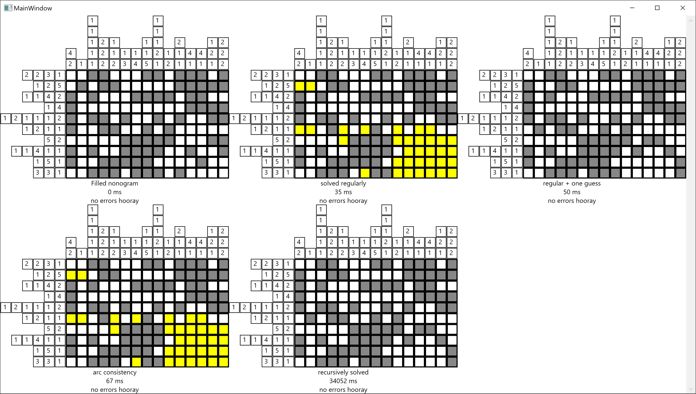
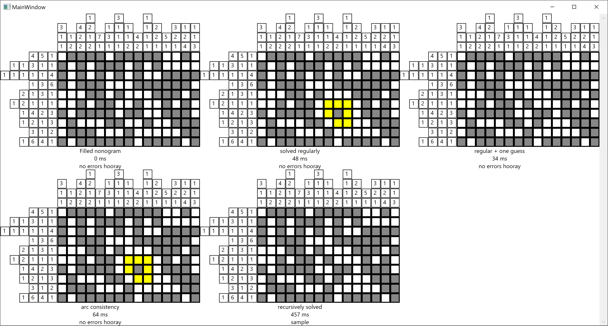

# NonogramSolver

Generate and solve random MxN nonogram with a variety of methods

At launch, generates a random MxN nonogram (by default 10x20) and tries to
solve it using:

* Contradiction solving w/o recursion
* Contradiction solving with one guess in case of ambiguity
* Arc consistency-3 algorithm
* Recursion with backtracking

First three algorithms might not solve the nonogram fully, but they
are significantly faster than backtracking. Backtracking seems to be able
to find depth-first solution in all casses that occured at testing.

Example of results:

